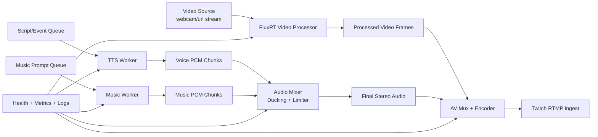

# AI Video + TTS + Music Streaming Plan

## 1. Goal
Build a production-ready pipeline that outputs:
- Live AI video (from the existing FluxRT stream path)
- Live TTS voice track (narration, chat responses, announcements)
- Live generated background music track
- One mixed audio stream + one video stream suitable for Twitch ingest

This plan keeps the existing stable app behavior intact and introduces audio generation as a separate staged operation with rollback points.

## 2. Scope
In scope:
- Runtime architecture and process boundaries
- Data flow and synchronization strategy
- Implementation milestones and acceptance criteria
- Reliability, observability, and failover behavior
- Twitch-ready output path
- Policy and licensing guardrails

Out of scope (for phase 1):
- Autonomous conversation engine persona logic
- Advanced scene choreography and avatar puppeteering
- Multi-platform simultaneous broadcast

## 3. Current Baseline
Known baseline in this repo:
- Existing stream app and baseline app are separated
- Stream demo can be launched separately on a non-7860 port
- GPU memory pressure can cause inference worker OOM and black output

Design principle for this plan:
- Never regress baseline app stability
- Introduce each new subsystem behind independent launch scripts/configs

## 4. Target Architecture

## 5. Process Layout
Use independent processes to isolate failures:

1. Video Processor Service
- Reuses existing stream processing path
- Produces processed frames to shared output queue or local RTP/pipe

2. TTS Service
- Input: text events
- Output: PCM chunks with timestamps
- Can be local model or API-backed provider

3. Music Service
- Input: style prompt + mood state
- Output: loopable PCM segments
- Pre-generates short horizon (for example 15-30 seconds ahead)

4. Audio Mixer Service
- Input: TTS chunks + music chunks
- Output: one stereo PCM output stream
- Handles ducking, limiter, gain normalization

5. AV Mux/Encoder Service
- Input: processed video + mixed audio
- Output: Twitch RTMP stream

6. Supervisor
- Starts/stops all services
- Performs liveness checks and restart policy
- Writes consolidated status snapshot

## 6. Timing and Sync Strategy
Single timing model:
- Master clock from monotonic system time
- Every audio chunk and video frame tagged with presentation timestamp

Sync rules:
- Keep an audio jitter buffer (2 to 5 seconds)
- Encode video at fixed target FPS
- If TTS is late, fill with short silence and keep music bed
- If music generation is late, repeat last loop segment with crossfade

Drift control:
- Measure audio-video skew continuously
- Correct small drift by resampling audio slightly
- Hard reset only if skew exceeds threshold (for example 300 ms)

## 7. Audio Mixing Rules
Voice intelligibility first:
- During speech: duck music by 8 to 14 dB
- Between speech: recover music over 300 to 600 ms

Loudness targets:
- Voice integrated loudness around -16 to -14 LUFS equivalent target behavior
- Music bed around -28 to -22 LUFS while speaking
- Master limiter true peak ceiling near -1 dBTP

Cleanup:
- Optional gentle de-esser on TTS if needed
- Avoid aggressive compression artifacts

## 8. Recommended Staged Implementation

### Stage A: Foundation and Contracts
Deliverables:
- New config file for AV pipeline settings
- Typed message schema for text events and audio chunks
- Supervisor script skeleton

Acceptance criteria:
- Services can start and stop independently
- Health endpoints return ready/not-ready states

### Stage B: TTS Integration (Voice Only)
Deliverables:
- TTS worker process
- Queue ingestion for text input
- PCM output writer + simple playback test

Acceptance criteria:
- End-to-end TTS latency within acceptable range for your use case
- No crashes under repeated prompts

### Stage C: Music Bed (Static Loop then Generated)
Deliverables:
- Static background loop source first
- Then replace with generated segment worker
- Segment crossfade in mixer

Acceptance criteria:
- No audible clicks at loop boundaries
- Music continuity during TTS events

### Stage D: Mixer + Ducking + Limiter
Deliverables:
- Real-time mixing service
- Sidechain ducking controlled by TTS activity
- Master limiter in chain

Acceptance criteria:
- Voice always intelligible
- Output level stable over long runs

### Stage E: AV Mux and Twitch RTMP
Deliverables:
- Encoder pipeline for processed video + mixed audio
- Twitch ingest URL and stream key support through env vars

Acceptance criteria:
- Sustained stream for at least 60 minutes
- No desync beyond threshold

### Stage F: Hardening and Operations
Deliverables:
- Auto-restart policy with backoff
- Alerting hooks for OOM, dropped frames, silent audio
- Runbook updates and rollback commands

Acceptance criteria:
- Recovery from single-process failure without full-stack restart
- Actionable logs and metrics for triage

## 9. Proposed Repo Additions
Suggested files (new):
- scripts/start_av_stream.sh
- scripts/stop_av_stream.sh
- scripts/audio/run_tts_worker.py
- scripts/audio/run_music_worker.py
- scripts/audio/run_audio_mixer.py
- scripts/av/run_mux_rtmp.py
- configs/av_stream_config.json
- docs/AV_RUNBOOK.md

Suggested updates (existing):
- RUNBOOK.md: add AV pipeline launch and troubleshooting section
- INSTANCE_PROVISIONING.md: include audio dependencies and port/process notes

## 10. Configuration Blueprint
Core config fields:
- video:
  - source_mode
  - width
  - height
  - fps
  - stream_processor_config_path
- tts:
  - provider
  - model
  - voice_id
  - sample_rate
  - max_latency_ms
- music:
  - provider
  - model
  - style_prompt
  - segment_seconds
  - pregen_horizon_seconds
- mix:
  - sample_rate
  - channels
  - duck_db
  - attack_ms
  - release_ms
  - limiter_ceiling_db
- output:
  - rtmp_url
  - stream_key_env
  - video_bitrate
  - audio_bitrate
  - keyframe_interval
- resilience:
  - restart_backoff_seconds
  - max_restarts_per_hour
  - oom_cooldown_seconds

## 11. Reliability and Resource Controls
GPU and memory guardrails:
- Do not run baseline heavy app and AV stream heavy app together by default
- Preflight check for available GPU memory before model init
- Fail fast with clear status when memory insufficient

Failure handling:
- TTS failure: keep stream alive with music bed + retry
- Music failure: keep stream alive with silence or fallback loop
- Video processor failure: show fallback slate and auto-restart worker

## 12. Observability
Log fields to include everywhere:
- timestamp
- component
- severity
- event type
- latency_ms
- queue_depth
- gpu_mem_mb
- dropped_frames

Key metrics:
- video_fps_actual
- audio_buffer_fill_ms
- av_skew_ms
- tts_latency_p95
- music_generation_latency_p95
- restart_count

## 13. Security, Policy, and Licensing
Channel/account behavior:
- Use transparent AI disclosure
- Do not impersonate a real person
- Use platform-approved ad controls only

Rights and licenses:
- Verify commercial rights for each TTS and music model/provider
- Keep a license inventory file for all runtime assets
- Avoid unlicensed copyrighted source material in prompts or training artifacts

## 14. Testing Plan

1. Unit tests
- Audio chunk schema validation
- Mixer ducking envelope math
- Timestamp alignment utilities

2. Integration tests
- TTS to mixer path under burst input
- Music segment rollover with crossfade
- AV mux stability for 30+ minutes

3. Soak tests
- 4 to 8 hour continuous run
- Forced fault injections (kill worker, network hiccup, OOM simulation)

4. Launch rehearsal
- Private test stream with full pipeline
- Verify quality, sync, and recovery behavior

## 15. Rollback Plan
At every stage, rollback means:
- Stop new AV services
- Restore previous launch script path
- Restore previous known-good config profile
- Keep baseline stream demo unchanged and restartable

## 16. Milestone Timeline (Example)
- Week 1: Stage A + B
- Week 2: Stage C + D
- Week 3: Stage E
- Week 4: Stage F + soak + launch rehearsal

## 17. Definition of Done
Pipeline is done when:
- Stable 60+ minute Twitch output with synchronized A/V
- Voice and music mix remains clear and consistent
- Automatic recovery works for single-service failures
- No regressions to existing baseline app workflow
- Documentation and runbooks are complete and repeatable
