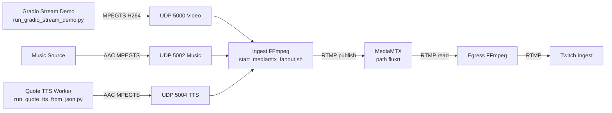

# FluxRT Streaming Architecture and Engineering Pattern

## Purpose

This document describes the streaming architecture used to make FluxRT stable for long-running live fanout, especially when upstream video or audio sources are intermittent.

Goals:
- Keep Twitch output alive even when optional audio sources are missing.
- Decouple realtime generation from external ingest delivery.
- Prevent startup deadlocks caused by missing quote/music streams.
- Allow safe restart boundaries (app vs fanout) during incidents.

## High-Level Architecture

## Components

### 1) Realtime App Plane

Process:
- `scripts/run_gradio_stream_demo.py`

Responsibilities:
- Captures source stream or local input.
- Applies FluxRT processing.
- Writes processed video to UDP 5000 as H264 MPEGTS.
- Launches optional quote-TTS worker for UDP 5004.

Design choices:
- Processing loop and source relay are resilient to source disconnects.
- Worker recovery logic cleans stale orphan worker processes.

### 2) Fanout Plane (MediaMTX)

Processes:
- `tools/mediamtx/mediamtx`
- Ingest loop generated by `scripts/streaming/start_mediamtx_fanout.sh`
- Egress loop generated by `scripts/streaming/start_mediamtx_fanout.sh`

Responsibilities:
- Ingest ffmpeg normalizes and mixes A/V into a single RTMP publisher to local MediaMTX.
- MediaMTX provides an internal stable rendezvous (`rtmp://127.0.0.1:1935/fluxrt`).
- Egress ffmpeg reads from MediaMTX and pushes to Twitch.

Why MediaMTX:
- Decouples local generation timing from external platform timing.
- Supports independent retries for publish and egress paths.
- Simplifies diagnostics (`mediamtx`, `ingest`, `egress` logs).

## Engineering Pattern: Always-Open Mixer Channel

### Problem

Traditional fanout startup blocks if optional inputs (music, TTS) are not present at process start.
This causes:
- No publish path to MediaMTX.
- Egress loop repeatedly failing with no publisher.
- Audio dropouts when optional sources appear/disappear.

### Pattern

Build the audio output as:
- Base channel: always-on silence input (`anullsrc`)
- Music leg: URL input when available, silence fallback otherwise
- TTS leg: URL input when available, silence fallback otherwise
- Final mix: `amix` over base + music + tts

Result:
- Broadcast always has a valid audio track.
- Stream can publish even with missing optional legs.
- Optional sources layer in without breaking continuity.

### Current Mix Topology

Filter graph:
- `[base]` from `anullsrc` at unity gain.
- `[music]` with configurable `MUSIC_MIX_VOLUME`.
- `[tts]` with configurable `TTS_MIX_VOLUME`.
- `amix=inputs=3:duration=longest:dropout_transition=0:normalize=0`

## Startup Detection Strategy for Bursty Inputs

Issue:
- Quote voice packets are bursty (for example every 30 seconds).
- Instant startup probes can miss active TTS and choose silence fallback.

Solution:
- Add bounded wait/probe windows before deciding fallback:
  - `MUSIC_WAIT_TIMEOUT` (default 5s)
  - `TTS_WAIT_TIMEOUT` (default 40s)
- Probe via ffprobe against UDP source.

Outcome:
- Fanout can attach TTS if it appears within the configured window.
- Startup remains bounded and deterministic.

## Operational Sequence

### Normal Startup

1. Start app:
- `uv run scripts/run_gradio_stream_demo.py --int8 --server-port 7861`

2. Start source processing in UI and confirm processed frames are moving.

3. Start fanout:
- `ENABLE_YOUTUBE=0 ENABLE_TWITCH=1 ENABLE_FACEBOOK=0 ENABLE_TTS_OVERLAY=1 AUDIO_SOURCE_MODE=url TTS_SOURCE_MODE=url TTS_MIX_VOLUME=2.6 AUDIO_INPUT_URL='udp://127.0.0.1:5002?pkt_size=1316' TTS_INPUT_URL='udp://127.0.0.1:5004?pkt_size=1316' scripts/streaming/start_mediamtx_fanout.sh`

### Recovery Sequence

If Twitch is not receiving:

1. Restart fanout only first:
- `scripts/streaming/stop_mediamtx_fanout.sh`
- Start fanout command again.

2. If still stuck on ingest decode errors, restart source stream in UI to force fresh keyframes.

3. Only restart app as last resort.

## Runbook Signals

Healthy indicators:
- MediaMTX log shows:
  - `is publishing to path 'fluxrt'`
  - `is reading from path 'fluxrt'`
- Egress log shows input from local RTMP and output mapping to Twitch URL.
- Stable audio perceived by listener with no periodic dropouts.

Unhealthy indicators:
- MediaMTX log repeats:
  - `closed: no one is publishing to path 'fluxrt'`
- Ingest log flooded with H264 decode errors and never reaches steady frame stats.
- Egress log repeats:
  - `Error opening input file rtmp://127.0.0.1:1935/fluxrt`

## Failure Modes and Mitigations

1) Missing optional audio at startup:
- Mitigation: Always-open base audio + fallback per leg.

2) Bursty TTS not detected on startup:
- Mitigation: TTS startup wait window (`TTS_WAIT_TIMEOUT`).

3) Upstream source instability (TLS EOF, dead URL):
- Mitigation: stream relay resilience and fallback source logic in app.

4) Worker process buildup and CPU slowdown:
- Mitigation: orphan worker cleanup on startup/recovery.

5) Video corruption/PPS decode instability:
- Mitigation: restart source stream to refresh keyframes; keep fanout restart isolated from app restart when possible.

## Configuration Surface

Main knobs:
- `AUDIO_SOURCE_MODE` (`url` or `silence`)
- `TTS_SOURCE_MODE` (`url` or `silence`)
- `MUSIC_MIX_VOLUME`
- `TTS_MIX_VOLUME`
- `MUSIC_WAIT_TIMEOUT`
- `TTS_WAIT_TIMEOUT`
- `VIDEO_BITRATE`, `FPS`, `OUTPUT_WIDTH`, `OUTPUT_HEIGHT`

Target selection:
- `ENABLE_TWITCH`, `ENABLE_YOUTUBE`, `ENABLE_FACEBOOK`
- Target URLs from `scripts/streaming/rtmp_targets.env`

## Engineering Lessons

- Separate realtime generation from egress transport with an internal broker (MediaMTX).
- Treat optional inputs as optional in graph topology, not required process dependencies.
- Always keep a valid broadcast audio track active.
- Prefer bounded retries and deterministic fallback over blocking startup.
- Restart the smallest failing subsystem first.

## Suggested Next Enhancement

Implement dynamic mid-run leg reattachment:
- Keep ingest continuously up.
- Detect live arrival on TTS/music UDP during runtime.
- Rebuild ingest graph with minimal switchover (or dual-ingest staged swap) so quote voice can join without restarting fanout.
